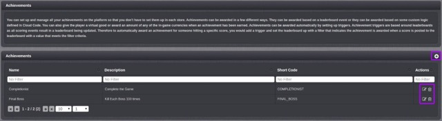

# Achievements

GameSparks Achievements support the rewarding of players for accomplishments within the game and are highly configurable with respect to both the reward and the criteria for when it is delivered.  This can support traditional achievements systems where virtual goods (e.g. badges or items) are won for particular tasks or combination of tasks being completed, but uses extend beyond this to level completion or XP progress bonuses, basic 'crafting', and rewards for breaking into the top [x] of a Leaderboard etc. They are cross-platform, meaning a significant convenience benefit (you don't have to set them up in each store) and support for cross-platform play, because game-progress can be tracked, and the reward can be used, across multiple platforms. Achievements can be awarded based a) on a Leaderboard event or b) they can be awarded based on some custom logic defined in Cloud Code. The reward delivered when an achievement is reached can be a) a virtual good, or b) an amount of any of the in-game currencies set up in the Virtual Goods section. Achievements can be awarded automatically by setting up triggers.  Achievement triggers are based around Leaderboard as all scoring events result in a Leaderboard being updated.  For example, to automatically award an achievement for someone hitting a specific score, you would add a trigger and set the Leaderboard up with a filter that indicates the achievement is awarded when a score is posted to the Leaderboard with a value that meets the filter criteria.

## Managing Achievement configurations

The Configurator Achievements page displays the list of Achievements and allows you to create new Achievements and edit or delete existing ones.

The icons (highlighted above) give you the following capabilities:

*  Add a new Achievements.
*  Edit this Achievements.
*  Delete this Achievements.

## Creating a new Achievement configuration

Click the  icon to create a new achievement.

* *Short Code* \- The Short Code is a mandatory field used to give the Achievement a unique identifier for use elsewhere in the Portal and in Cloud Code.
* *Name* \- The Name field is a mandatory field used as an identifier to help the user find the challenge in the Portal.
* *Description* \- The Description is a mandatory field which should be used to describe the challenge.
* *Virtual Good Award*- The amount of each of the currencies to award a player as a reward for gaining the achievement.
* *Currency Awards* \- The amount of each of the currencies to award a player as a reward for gaining the achievement.
* *Leaderboard* \- Achievements can be triggered by Leaderboard events or Cloud Code. Select the required Trigger here.
* *Repeatable*  \- This Achievement can be earned multiple times.

## Creating Achievement Triggers

Press the  icon to add triggers for non-scripted Achievements.

*Trigger Data* \- If a Leaderboard is selected the Attributes of the Leaderboard would be available for you to choose. You can also trigger a Leaderboard based on the users global or social position. Select from one of the four options:

* *New Global Rank* \-  A new position in the global Leaderboard.
* *Old Global Rank* \- An old position in the global Leaderboard.
* *Global Rank Change* - The number of places a player has moved in the global Leaderboard.
* *New Global % Rank* \- The new percentage change in the player's global Leaderboard position.
* *Old Global % Rank* \- The old percentage change in the player's global Leaderboard position.
* *Global Rank % Change* \- The percentage change in the player's global Leaderboard position.
* *New Social Rank* \- A new position in the social Leaderboard.
* *Old Social Rank* \- An old position in the social Leaderboard.
* *Social Rank Change* \- The number of places a player has moved in the social Leaderboard.
* *New Social % Rank* \- The new percentage change in the player's social Leaderboard position.
* *Old Social % Rank* \- The old percentage change in the player's social Leaderboard position.
* *Social % Rank Change* \- The percentage change in the player's social Leaderboard position.

*Filtering* \- Operators which allow you to filter the trigger:
* *\** \- any value.  
* *=* \- value equal to.
* *!=* \- value not equal to.
* *<* \- value greater than.
* *>* \- value less than.
* *<=* \- value greater or equal to.
* *>=* \- value less or equal to.
* *%* \- value is divisible by.
* *Filter Value* - The value of the Filter.

## Example Triggers

If you want to award the user for getting a score over 100 on a Leaderboard you would have a set up similar to this:

If you want to award an Achievement for being top of the global Leaderboard you would have the following configuration:

