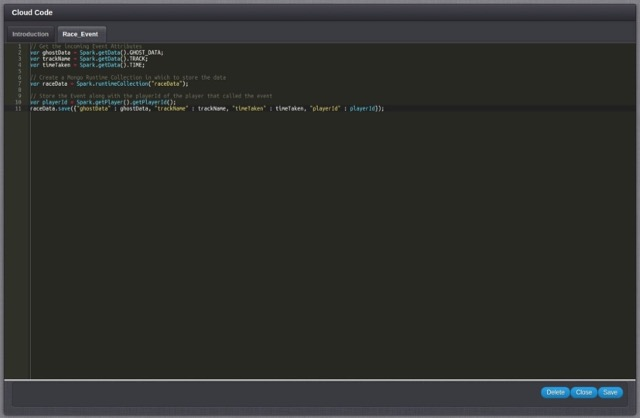
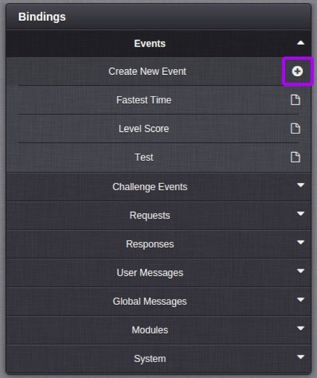
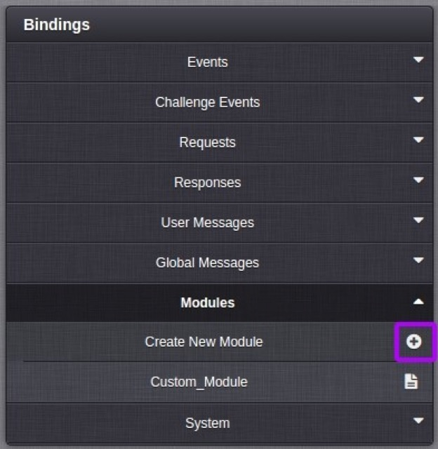

# Cloud Code

The Cloud Code section of the Configurator lists all the potential interception points that Cloud Code can be bound to, and has a JavaScript editor in which the interception code can be written. The Bindings section is split into eight sub-categories, further explained in the sections below.


To access the JavaScript editor select the name of the script from one of the eight drop down menus in the Bindings section.  Use the Delete, Close and Save buttons at the bottom of the editor to manage your scripts.

*Note*: You can also save your scripts using standard key press combinations, CMD+S on OSX and CTRL+S on Windows and Linux.



### Events

This list contains an entry for each Event you have created within the GameSparks platform. When a [LogEventRequest](../../API Documentation/Request API/Player/LogEventRequest.md) is received, the corresponding script is executed allowing you to run custom code on the platform. You can access the current player making the request using  Spark.getPlayer(). The Create New Event button allows you to quickly create a new Event from the Cloud Code section of the Configurator.



Clicking the *+* button will open the same Form as in the [Events](./Events.html) page to allow Event creation .

### Challenge Events

This list contains an entry for each Event you have created within the GameSparks platform. When a [LogChallengeEventRequest](../../API Documentation/Request API/Multiplayer/LogChallengeEventRequest.md) is received, the corresponding script is executed allowing you to run custom code on the platform. LogChallengeEventRequest contains an attribute "challengeId", it's useful to get this value for keying your own data, to access the value you can call Spark.data.challengeId. To get the challenge object stored within GameSparks the following call should be executed:

```    
    var myChallenge = Spark.getChallenge(Spark.data.challengeId);
```

You can also access the current player making the request using `Spark.getPlayer()`. The Create New Event button allows you to quickly create a new Event from the Cloud Code section of the Configurator.  See the previous section on Event for details.

### Requests

This list contains an entry for each Request you can call within the GameSparks platform. When a Request is received, the corresponding script is executed allowing you to run custom code on the platform. It should be noted that LogEventRequest and LogChallengeEventRequest are global scripts that will be executed for these request types before a specific script is called for each event. This allows you to add a common functionality to all Events. You can access the current player making the request using `Spark.getPlayer()`.

### Responses

This list contains an entry for each Response that can be returned from the GameSparks platform. When a Response is created, the corresponding script is executed before sending it to the player allowing you to run custom code on the platform. You can access the current player who has generated the response using `Spark.getPlayer()`.

### User Messages

This list contains an entry for each Message that can be returned from the GameSparks platform. Before a Message is sent out to each player within a challenge the corresponding script is executed allowing you to run custom code on the platform. You can access the current player who has generated the response using  `Spark.getPlayer()`.

### Global Messages

This list contains an entry for each Message that can be returned from the GameSparks platform. When a Message is created the corresponding script is executed allowing you to run custom code on the platform. Note you can not access the current player in a global message Cloud Code script.

### Modules

Modules allow you to create your own libraries of JavaScript that can be included within other scripts. This allows you to separate common functionality that needs to be shared between scripts into a single module that can be included. To include a module within your script use the require method as follow :

```
    require("MODULE_SHORT_CODE");
```

Using require, you can load a module into the current execution context. This is not common.js require, but a more basic inclusion pattern, where the loaded module is inlined within the current script. If you have circular reference between modules, the require method will only load a single module once per require invocation. This is to protect from infinite loops and stack overflows. You can conditionally require modules based on input parameters etc to have a single script that can perform multiple tasks without having a large script:

```    
    if(something) {
        require("MODULE_SHORT_CODE_1");
    } else {
        require("MODULE_SHORT_CODE_2");
    }
```

To create a new module click the Create New Module button, then enter a short code to uniquely identify this module script.



### System

The System tab contains a number of System Events that are able to trigger some JavaScript Cloud Code:

  * *Callback Url* - This script is executed whenever something hits the [Callback Url](/Tutorials/Cloud Code, and the Test Harness/External HTTP Callbacks.md).
  * *Every Day* - This script is executed at 12:00am UTC each day.
  * *Every Hour* - This script is executed on the hour, every hour.
  * *Every Minute* - This script is executed on the minute, every minute.
  * *File Delivered* - This script is executed when a file is delivered via SFTP to the GameSparks platform. SFTP access to the GameSparks platform is available on request. Please raise a support ticket to request this.
  * *Game Published* - This script is executed when your game configuration changes. On the preview stage this script will be executed each time you save your game within the portal, you should track your own internal version number in preview if this script is performing potentially dangerous operation. On the live stage, this script is executed once each time you publish your game.
  * *Player Connected* - This script is executed each time a player connects and is identified. `Spark.getPlayer()`  is set to be the player who connected so you can query or manipulate the data related to the player.
  * *Player Disconnected* - This script is executed each time a player disconnects. `Spark.getPlayer()`  is set to be the player who disconnected so you can query or manipulate the data related to the player.
