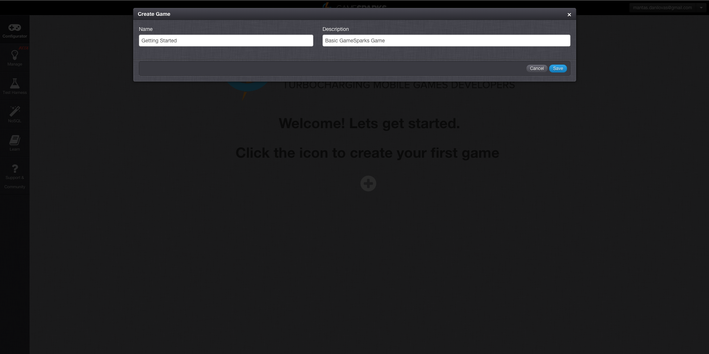
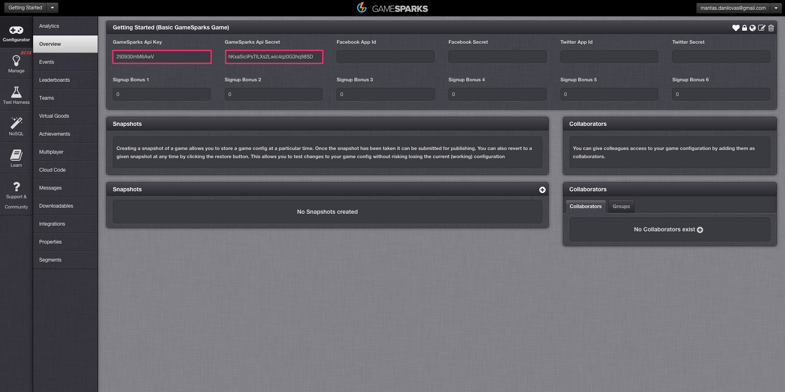
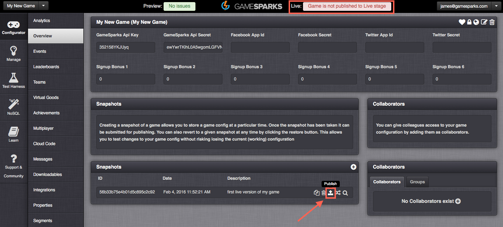

# Creating a Game

The GameSparks interface has such a broad scope of capabilities, and this can make deciding where to begin a little difficult. This section has been created to walk you through some of the initial tasks that will get you going, helping you to understand how the platform pieces come together.

## Creating the Game

B
efore getting started as a new user, you will need to [Register](https://portal.gamesparks.net/register.htm) an account on the Developer Portal, and you'll need to create a game. If this is your first time using the Portal, you will be greeted by the Welcome screen. Click the icon in the middle of the screen to create your first game. If you have used GameSparks before, click "Create Game" from the drop down menu in the top left of the screen. Give your game a name and a description then hit *Save*. The name and description allow you to identify the game in the portal, you can change them at any time so don’t worry about making any final decisions at this point.

## Keys and Secrets

After hitting *Save* you will be taken to the [Overview](/Documentation/Configurator/Overview.md) section, where your game is now ready to be configured. At this point you should take note of your *GameSparks API Key* and *GameSparks API Secret* as these will be used in the upcoming set up of your chosen SDK.

## Publishing for Launch

When creating a game, the game goes into a *PREVIEW* stage.  There are two stages - *PREVIEW* and *LIVE*.  PREVIEW is where everything is first created such as game configuration, Cloud Code and then testing it all using a small number of test players in the Test Harness.  Once you are happy with the state of your game, you can create a Snapshot.  This takes a copy of everything you've created in that state.  When that is done, you can publish the Snapshot.  Publishing the Snapshot will copy the game as it was created in that Snapshot, from the *PREVIEW* stage, into the *LIVE* stage.  This allows you to then carry on making future changes in PREVIEW, whilst your customers are playing on the LIVE stage, knowing exactly what state the LIVE game is in.  When you are ready to add more changes, simply create another Snapshot, Publish the new snapshot, and the whole process repeats again.  Simple!

**Really Important!  The LIVE stage is the stage to be used when you are ready to release your game to the public, and should be the ONLY stage your players use.  This is because there is a limit of how many concurrent users can connect to the PREVIEW stage at any one given time.  That limit is 100.  If you have more than 100 concurrent Players trying to access your game, they won't all be able to connect successfully.  Obviously, this is not what you want, so remember to Snapshot then Publish!**

## SDK Instructions

|   |   |   |
|---|---|---|
