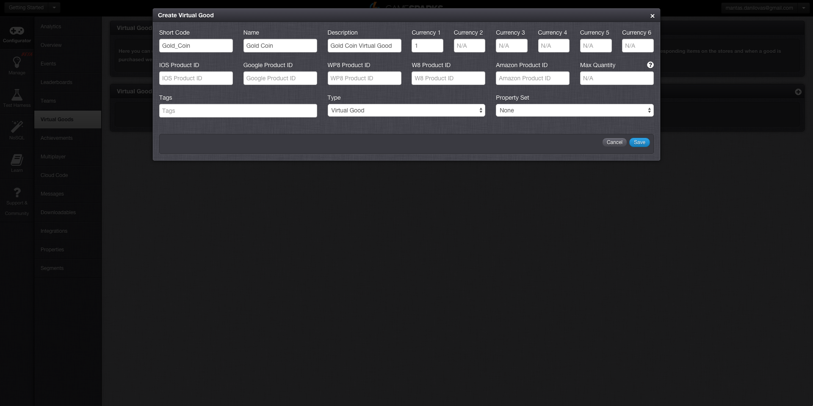

# Creating a Virtual Good

## Introduction

In the context of the GameSparks platform, a Virtual Good is any in-game asset that can be awarded, accumulated or bought. This would cover XP points and in-game currencies as well as specific goods that deliver benefits in-game (convenience, customisation, competitive advantage etc). These can be used and consumed cross-platform. You can set up Virtual Goods to be bought as IAPs. This is when you associate the Virtual Goods with the Product IDs of the corresponding items on the stores, and when a good is purchased we can reconcile the store receipts with the items. You can also establish relationships between them so they can be traded or converted. There are multiple ways of awarding Virtual Goods, in this tutorial we will award the player with a Virtual Good by "purchasing" it, this is done via [BuyVirtualGoodsRequest](/documentation/request-api/store-request-api/buyvirtualgoodsrequest).

## Virtual Good

First you will need to navigate to the Virtual Goods page in your Configurator. Next, add a new Virtual Good with the following parameters (shown below). For an in-depth guide about Virtual Goods click [here](../..\Tutorials\Currencies, Virtual Goods and Achievements\Virtual Goods.html). All parameters that are not listed below can be left as default.

  * Short Code - This is the reference by which we will award the Virtual Good, these are always unique.
  * Name - This field is used when listing Virtual Goods in all of the Returns.
  * Description - This field is used to display what the Virtual Good is used for, this is primarily for your benefit in the Virtual Goods Configurator.
  * Currency 1 - This is the amount of Currency 1 that is required to "purchase" this Virtual Good.

## Test Harness

Now everything is set up, you will need to navigate to the Test Harness and authenticate with one of the players you have [registered](Using Authentication.html) previously. The [previous](Creating An Achievement.html) tutorial showed you how to award your player with some currency via an Achievement. Now you are ready to purchase your first Virtual Good. Just to be sure, let's validate that the player has enough of Currency *1* to purchase the Virtual Good using the [AccountDetailsRequest](https://docs.gamesparks.net/documentation/request-api/player-request-api/accountdetailsrequest).

To get the Virtual Good you need to navigate to the Store and then [BuyVirtualGoodsRequest](/documentation/request-api/store-request-api/buyvirtualgoodsrequest). To do this you will have to fill in JSON builder with the following values and click Play:

  * *currencyType* \- This is the currency you're "paying" with, for us this is *1*.
  * *quantity* \- This is the quantity of the given Virtual Good that you wish to purchase, for us this is *1*.
  * *shortCode* \- The Short Code of your Virtual Good you will be using in this request, for us this will be the *"Gold_Coin"*.

Although receiving a successful [BuyVirtualGoodsResponse](/documentation/response-api/store-response-api/buyvirtualgoodresponse) is a good indication everything has succeeded, you should still validate this by doing an [AccountDetailsRequest](https://docs.gamesparks.net/documentation/request-api/player-request-api/accountdetailsrequest). You should see that, the currency 1 has decreased by 1 and you've been awarded with 1 Gold Coin.

 

Continue the tutorial for your chosen SDK:

|   |   |   |
|---|---|---|
