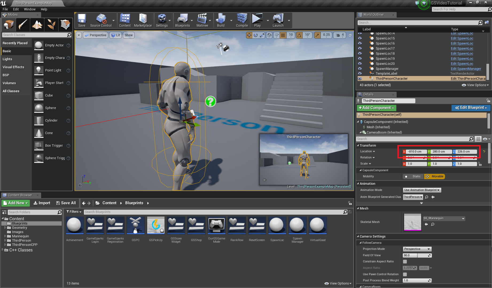
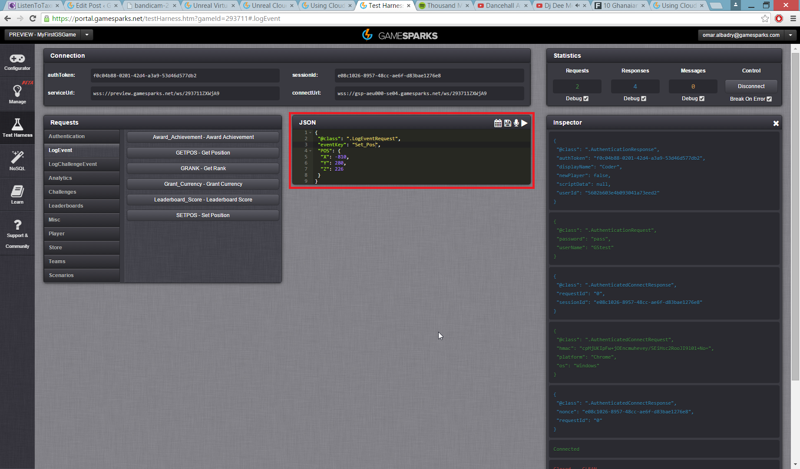
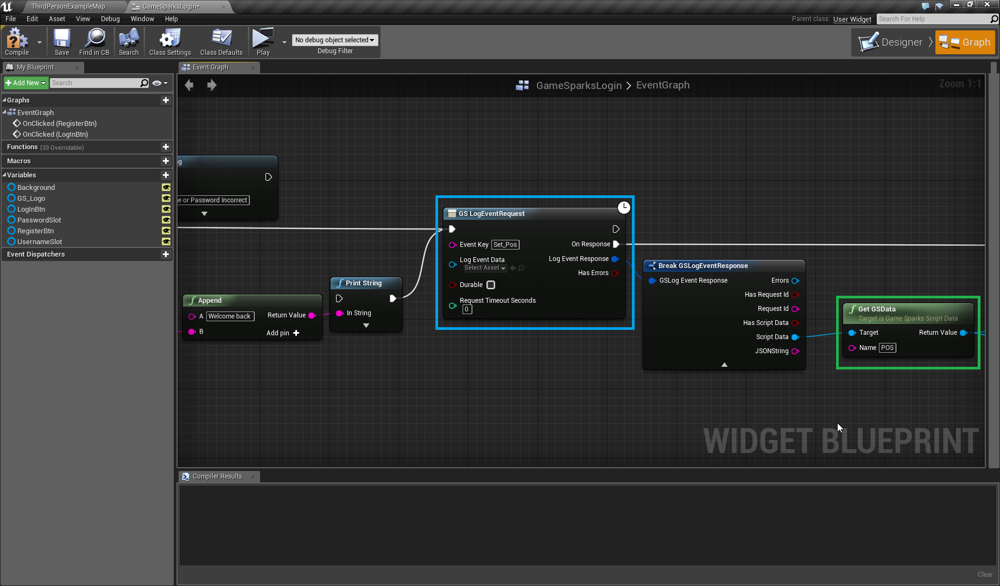
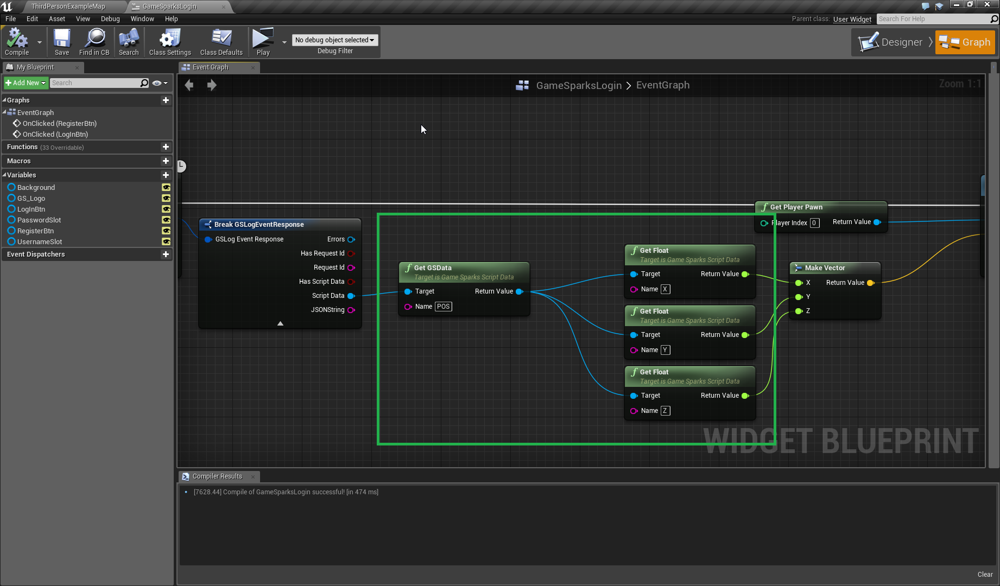
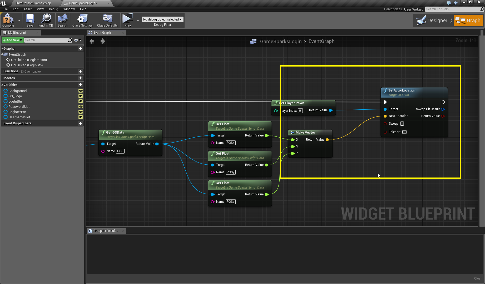
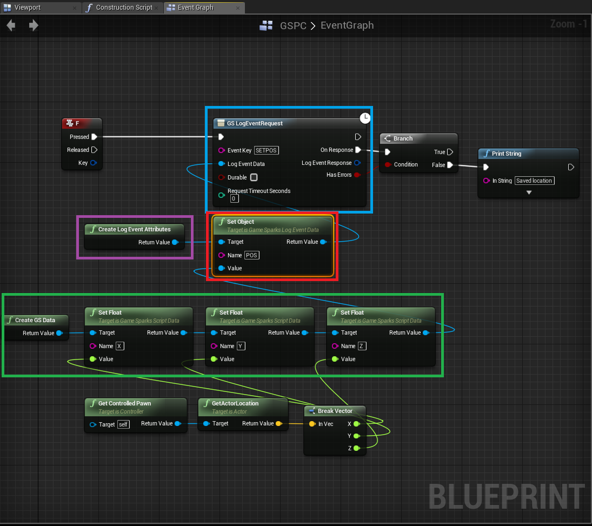
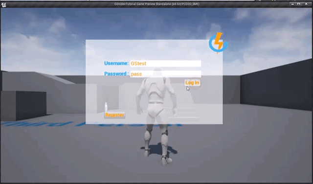

# Unreal Cloud Code

## Introduction

Previously, we learnt how to use Cloud Code in the GameSparks Portal. Now we are going to show you how to use the GameSparks nodes that log Events that have been set up in your Portal. In this tutorial the Player logs the* 'Get_Pos'* event which retrieves the location that was last saved on the player's database. It's useful to use the Test harness and send a default value for the player's initial location, this can be a pawn's initial spawn location in your game. The second part of the tutorial will feature saving the player's pawn location using a key input that logs the *'Set_Pos'* event.

*Default location*

  * Set up your values for a new Player using the 'Set_Pos' Event (Default value would be (0,0,0). In our example we used the Test Harness to pass in the initial spawn point).
*Get Event*

  * Drop in a GS EventLogRequest node and use it to call the 'Get_Pos' Event right after the Player authenticates.
  * Retrieve the values from 'Get_Pos' and use it in SetActorLocation function to teleport your Player.
*Set Event*

  * Use GS EventLogRequest to call the 'Set_Pos' Event to save the Player's location by passing in the X,Y and Z coordinates.
*Testing Events*

  * Call the 'Set_Pos' Event from user input (In this example we use the *F* key).

[wpdm_file id=29 title="true" ]

## Setting up Events

### *Default Location*

Send the pawns initial spawn location from the editor to the Portal through the *Test Harness* for the authenticated player to simulate a saved default initial spawn location.

Use the *'Set_Pos'* Event to save those three coordinates on the *Test Harness* after you *authenticate*.

### *Get Event*

For this example call the *'Get_Pos'* Event straight after the Player authenticates. Once the Player is *authenticated,* their location will be set to the values received from '*Get_Pos'*. This is why it is important to have a default value. The get sequence will take place in the Login Widget, which initiates the player *authentication.* On valid response, the Player will teleport to the location retrieved through the saved X,Y and Z values. Use a *GS LogEventRequest* node to call Events made in your Portal from the Unreal Engine. Making your Events *durable* means that they will execute the moment they receive connection if they don't successfully execute the first time due to a dropped connection between your game and the service. When calling the '*Get_Pos*' Event, the *ScriptData* will be returned. To access that *ScriptData,* break the *LogEventRequest* and drag off the '*LogEventResponse*' *struct*, then drag off the '*Get GSData*' node from '*ScriptData*' port which will allow you to access Key Value pairs within your *GSData*.

After retrieving the '*POS*' JSON from the *GSData* node, you now have the ability to retrieve individual values saved inside it. In this case those values will be the three coordinates *x*,*y* and *z*.

After using the get node to access values within the *GSData,* you are now able to receive those values and use them in your gameplay sequence. In this case this will be setting the Players location. Now set up the "*Set_Pos*" Event which will take place in the *PlayerController.* PlayerControllers allow the use of key input.

### *Set Event*

The Set Event will be called in the same way as the Get Event, using the *GS LogEventRequest* node, except this time you will be passing through an *Attribute* which holds the X,Y and Z values similar to calling a function with a parameter. To pass data through the '*POS*' attribute, create a *LogEventAttributes* node and connect it to the '*Set Object*' node. This will reference the *Short Code* for the attribute. The values passing into '*Set object'* will need to be created using the *'Create GSData'* node (In green). This will allow you to create a packet of data or collection of Key Value pairs. Set the values X,Y and Z as floats. Make sure the sequence has a way of executing. For this example the sequence will be executed by Player input, when hitting the F key on the keyboard.

## Testing

Run your game and test your Events are working correctly in-game. Use the login screen to *authenticate* your test player. When your player is *authenticated*, he will be teleported to the same location, so you won't see a difference. If you move your pawn, then hit the F key and see the *saved* print string. Close the game down, then  relaunch your game and re-authenticate your player again. Your pawn should teleport to the last location saved against your authenticated Player. This is the basis of saving data persistently using GameSparks. You can use a combination of Events and *Cloud Code* for nearly unlimited amounts of configuration for your game.

