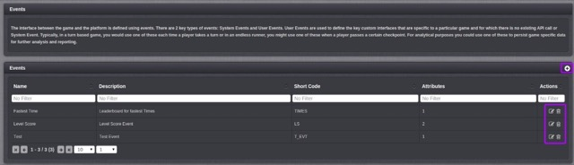
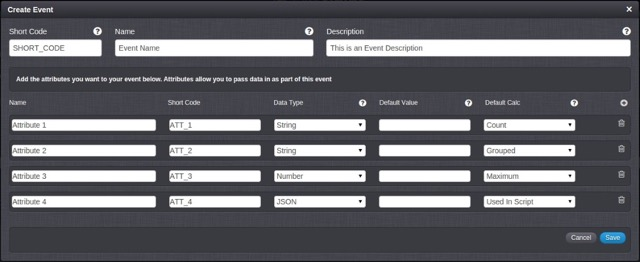

# Events

Events give you the ability to define custom data structures that you want to pass into the platform via the LogEventRequest and LogChallengeEventRequest API calls.

## Managing Event configurations

The Configurator Event page displays the list of Event and allows you to create new Event and edit or delete existing ones.

The icons (highlighted above) give you the following capabilities:

  *  Add a new Event.
  *  Edit this Event.
  *  Delete this Event.

## Creating a new Event configuration

The Create/Edit screen contains the following fields:

  * *Name* \- the name of the Event.  This is used to identify the game in the portal if you have a number of Events.
  * *Description* \- a simple description for the Event.
  * *Short Code* - the short code of the event, used by the API to allow you to identify which event you want to call.

### Creating Event Attributes

Each event can have a number of attributes associated with it.

Add an attribute by clicking the  icon.  Each attribute has a number of different configuration options that can be defined within the form:

  * *Name* \- the name of the Attribute.  This is used to identify the attribute if there are several associated with an Event.
  * *Short Code* \- the short code of the Attribute, used by the API to allow you to identify which Attribute you are trying to set.
  * *Data Type* \- each attribute needs to be defined as either String, Number or JSON.
  * *Default Value* \- allows a specific value to be used if the user request does not contain this attribute.
  * *Default Calculation*
    * *Maximum* \- a running total will be created to track the maximum value posted.
    * *Minimum* \- a running total will be created to track the minimum value posted.
    * *Sum* \- a running total will be created to add all the values posted together.
    * *Count* \- a running total will be created to count the number of times the player has called the event.
    * *Used In Script* \- the event will not be used in a running total.
    * *Grouped* \- the running total will use this attribute to group other attributes. This will lead to a running total with an entry per attribute/user combination.

<q>**Note:** [Running Totals](/Documentation/Configurator/Running Totals.md) is a concept explained further in the next post.</q>
