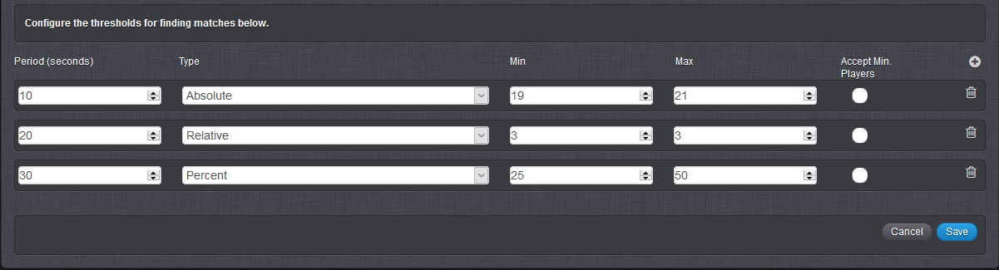

# How to Match Players

In this tutorial, we'll create a Match configuration with customised Thresholds in the GameSparks Portal and use this configuration to perform a Match in the Test Harness that will match Players in the game. As a brief example of these features, you may want to match Players based on their similar skill level in your game, so that Players can play against someone of equal ability to make it more enjoyable for all.

We'll also see how:
* Drop In/Drop Out can be enabled for a Match and have matching players added to or removed from the Match after the Match is first made.
* Manual Matching can be used, allowing you to use a custom mechanism for completing a Match from the list of matching players the portal returns for the matching criteria.

## Creating a Match

*1.* To create a Match, navigate to the Portal's *Configurator *and go to the *Multiplayer* section.

*2.* Under *Multiplayer*, click the  icon for *Matches*:


  The *Create Match* form appears:


The *Create Form* contains the following fields:

* *Short Code* \- Enter an identifier for the Match.
* *Name* \- Enter a name for the Match.
* *Description* \- Enter a description of the Match.
* *Min. Players* \- The minimum number of Players for the Match.
* *Max. Players* \- The maximum number of Players for the Match.
* *RealTime* \- Select for a Real-Time Match.
  * *Realtime Script* \- If Real-Time, select a script which will be run on the Real-Time server.
* *Drop In/Drop Out* \- Select for a Drop In/Drop Out Match.
  * *Player disconnect delay in seconds* \- The number of seconds after a match is found before a player in the match who disconnects is removed from the match. If you don't enter a value or enter zero, the player is removed instantly on disconnection.
  * *Expire in seconds* \- The number of seconds after a match is made that players can drop in or drop out. If you don't enter a value or enter zero, the drop in/drop out period for the match doesn't expire.

*3.* In the *Create Match* form, specify the *Short Code*, *Name* and *Description* of your Match and select the  icon to create the desired number of thresholds you want to use in the Match.


  

In this example:
* We've added 3 Thresholds to determine player matching: *Absolute*, *Relative*, and *Percent*. (See *Working with Thresholds* below for how to use these different types of Threshold in a Match.)
* We've specified a minimum of 2 and maximum of 4 players for the match, which means this will be a *multiplayer Match*:
  * Multiplayer matching is based on synchronous messages that match players based on similar skill attributes, continuously adding players to the Match and updating those already in the Match until the specified maximum number of Players has been reached, similar to the way a Challenge works.
* We haven't selected *Accept Min. Players* for any of the Thresholds. This means that a Match will be found, only when 4 players meet the matching criteria that the Thresholds define.

<q>**Note:** You cannot set the minimum number players for a match to be fewer that 2. If you set the maximum number of players also at 2, then this is a Head-to-Head match.</q>

In this example, we haven't:
* Selected for a Real-Time match and no Realtime script will be executed on the Real-Time server when a Real-Time session starts. You can learn more about Real-Time services [here](/Tutorials/Real-Time Services/README.md).
* Selected for a Drop In/Drop Out match. (See *Using Drop In/Drop Out* below for more on how to use this feature for a Match.)
* Selected to Manually match players. (See *Manual Matching* below for more on how to use this feature for a Match.)
 

*4.* Click to save the Match. The *Create Match* form closes and your Match is added to the *Matches* list under *Multiplayer*:


## Working with Thresholds

You can use the Thresholds that you add to a Match configuration to define the criteria that determine player matching. For each Threshold you can define:
* **Match Type.** You can choose from three match types for a Threshold and impose a different degree of precision to the matching process using these types.
* **Period.** Set a period to control how long you want the matching process to continue trying to find a match using a Threshold.
* **Accept Minimum Players.** Match all players found so far after that selected threshold period is complete and that satisfy its matching criteria, but only if the number of players found is more than or equal to the value entered in the *Min. Players* field.

Here, we'll use the Thresholds we defined for our example Match configuration to explain Match types, accepting the minimum number of players, and periods:

  

### Match Types

A Match is built upon the different types of range criteria for the common attribute (that is, skill level) that we want to match Players on. There are 3 different types of range criteria that can be used to fine-tune your Matches which make them more precise in matching Players with similar attributes:

* *Absolute* \- Match Players that fall between the specified minimum and maximum range of absolute values.

  **Example:** The first Period in the screenshot above will only match two Players who have a skill level between the values of 19 and 21.
* *Relative* \- Find a match between two Players where their values are no wider apart than the specified minimum and maximum values.

  **Example:** If Player 1 submits a [MatchmakingRequest](/API Documentation/Request API/Multiplayer/MatchmakingRequest.md) with a skill level of X, Player 1 will only be matched to another Player who has a skill level 3 greater than or 3 less than X.
* *Percentage* \- Similar to Relative, find a match between Players where their values are no wider apart than the specified minimum and maximum percentage values.

  **Example:** If Player 1 submits a *MatchmakingRequest* with a skill level of X, Player 1 will only be matched to another Player who has a skill level between 25 percent less than and 50 percent greater than X.


### Match Periods

We can specify how long we want to look for a Match Type before giving up. This can be done by creating Periods of time where we specify the Type on which we should match Players.

We can create multiple Threshold periods during one Match and, in those Periods of time, we can specify different Types on which we should match Players. In the examples above, we have 3 Thresholds, all with different Periods of time (in seconds). Once the *MatchmakingRequest* is executed, if the first Period does not find a suitable match, the following periods will continue subsequently to try to find a match until their duration has expired. By having a combination of longer and shorter Periods, we can fine-tune our Match criteria to be stricter or more relaxed, whilst the time duration of the Match progresses.

In the match example shown the screenshot above, the first Threshold will try to find a match based on an *Absolute* Match Type for *10* seconds. The second and third Thresholds will try to find a *Relative* match for *20* seconds and a *Percentage* match for *30* seconds respectively, before the Match ends.

### Accept Minimum Players

Selecting this for a particular threshold instructs the Match to match all the Players it has currently found after that selected threshold period is complete, on the condition that the number of Players found and matched is more than or equal to the value in the *Min. Players* field. If it hasn't found enough Players according to this value, the *Accept Min. Players* value is ignored and the Match continues to find Players in the next threshold.

**Example:** Suppose our first Threshold for the Match, using Absolute Match Type, was selected to accept minimum players. *Min. Players* for *MULTI_MCH* is set at 2. Now suppose a player with skill level 20 issues a *MatchmakingRequest* using the *MULTI_MCH*. If only 1 other matching player is found in the first 10 seconds - with, say, skill level 21 - then the Match would be made for these 2 players and the matchmaking process would cease.

<q>**Remember!**  If *Accept Min. Players* is not selected for any threshold, and there aren't enough Players found in the Match to reach the *Max. Players* value, no Match will be found, even if there are more Players than the *Min. Players* value.</q> 

### Multiplayer Matching Examples

Using the three <b>Thresholds</b> in the above *MULTI_MCH* example above and for a 3-player context, here are some example scenarios to demonstrate just how the matching process works:

* **Scenario 1.** Players *1*, *2*, and *3* have skills of *20*, *15*, and *17* respectively. Each player submits a *MatchmakingRequest* in that order and each player's request is issued within player *1's* first Threshold period of 10 seconds. Players *1* and *3* would be matched based on the second Threshold which uses the Relative Match Type.

* **Scenario 2.** Players *1*, *2*, and *3* have skills of *20*, *15*, and *16* respectively. Each player submits a *MatchmakingRequest* in that order and each player's request is issued within player *1's* first Threshold period of 10 seconds. Players *2* and *3* would be matched based on the second Threshold which uses the Relative Match Type.

* **Scenarios 3.** Players *1*, *2*, and *3* have skills of *20*, *15*, and *16* respectively. Player *1* submits a *MatchmakingRequest*. However, players *2* and *3* submit their requests later and during player *1's* *second* Threshold period of 20 seconds. Players *1* and *3* are matched based on the third Threshold which uses the Percent Match Type.


## Multiplayer Matching in the Test Harness

To match multiple Players, we will use the [MatchmakingRequest](/API Documentation/Request API/Multiplayer/MatchmakingRequest.md) in the *Test Harness*.  

*5.* In the *Test Harness*, authenticate 4 Players (in separate browser tabs) and have them each submit a *MatchmakingRequest* within 10 seconds so that all Players can attempt to match each other in their first threshold period.

*<< UPDATE! there is extra info with these msgs now! Check out in Test Harness. >>*

Players *1*, *2*, *3* and *4* should have a skill of *16*, *21*, *19* and *22* respectively.

```
{
 "@class": ".MatchmakingRequest",
 "matchGroup": "group1",
 "matchShortCode": "MULTI_MCH",
 "skill": 16
}
```
```
{
 "@class": ".MatchmakingRequest",
 "matchGroup": "group1",
 "matchShortCode": "MULTI_MCH",
 "skill": 21
}
```
```
{
 "@class": ".MatchmakingRequest",
 "matchGroup": "group1",
 "matchShortCode": "MULTI_MCH",
 "skill": 19
}
```
```
{
 "@class": ".MatchmakingRequest",
 "matchGroup": "group1",
 "matchShortCode": "MULTI_MCH",
 "skill": 22
}
```

The display names used for the 4 players in the following examples are *MTest1*, *MTest2*, *MTest3*, and *MTest4*.

As you will notice, Players *2* and *3* will be matched almost immediately, because their skill values fall within the *first* (Absolute) threshold period.

Player 3 *MatchUpdatedMessage:*

```

{
 "@class": ".MatchUpdatedMessage",
 "addedPlayers": [
  "5773f1ca4ff5440497143fdf"
 ],
 "gameId": 358380,
 "matchGroup": "group1",
 "matchShortCode": "MULTI_MCH",
 "messageId": "5773f7254ff544049714cfeb",
 "notification": true,
 "participants": [
  {
   "displayName": "MTest2",
   "externalIds": {},
   "id": "5773f1ca4ff5440497143fd0",
   "online": true
  },
  {
   "displayName": "MTest3",
   "externalIds": {},
   "id": "5773f1ca4ff5440497143fdf",
   "online": true
  }
 ],
 "playerId": "5773f1ca4ff5440497143fdf",
 "summary": "MatchUpdatedMessage"
}


```

Around 10 seconds later, Player *4* will also be added to the Match, who will be matched based on his skill value falling within the *second* (Relative) threshold period.  As each Player is added to the Match, both them and the existing Players on the Match receive a [MatchUpdatedMessage](/API Documentation/Message API/Multiplayer/MatchUpdatedMessage.md).

Player 3 *MatchUpdatedMessage:*

```

{
 "@class": ".MatchUpdatedMessage",
 "addedPlayers": [
  "5773f1ca4ff5440497143fef"
 ],
 "gameId": 358380,
 "matchGroup": "group1",
 "matchShortCode": "MULTI_MCH",
 "messageId": "5773f72c4ff544049714df8d",
 "notification": true,
 "participants": [
  {
   "displayName": "MTest2",
   "externalIds": {},
   "id": "5773f1ca4ff5440497143fd0",
   "online": true
  },
  {
   "displayName": "MTest3",
   "externalIds": {},
   "id": "5773f1ca4ff5440497143fdf",
   "online": true
  },
  {
   "displayName": "MTest4",
   "externalIds": {},
   "id": "5773f1ca4ff5440497143fef",
   "online": true
  }
 ],
 "playerId": "5773f1ca4ff5440497143fdf",
 "summary": "MatchUpdatedMessage"
}


```

Finally, Player *1* will be added to the Match, who is matched based on his skill value falling within the *third* (Percent) threshold period.  This will result in a [MatchFoundMessage](/API Documentation/Message API/Multiplayer/MatchFoundMessage.md).


```

{
 "@class": ".MatchFoundMessage",
 "gameId": 358380,
 "matchGroup": "group1",
 "matchId": "5773f7364ff544049714f0d5",
 "matchShortCode": "MULTI_MCH",
 "messageId": "5773f7364ff544049714f0ea",
 "notification": true,
 "participants": [
  {
   "displayName": "MTest4",
   "externalIds": {},
   "id": "5773f1ca4ff5440497143fef",
   "online": true,
   "peerId": 4
  },
  {
   "displayName": "MTest3",
   "externalIds": {},
   "id": "5773f1ca4ff5440497143fdf",
   "online": true,
   "peerId": 3
  },
  {
   "displayName": "MTest1",
   "externalIds": {},
   "id": "5773f1c94ff5440497143fc2",
   "online": true,
   "peerId": 1
  },
  {
   "displayName": "MTest2",
   "externalIds": {},
   "id": "5773f1ca4ff5440497143fd0",
   "online": true,
   "peerId": 2
  }
 ],
 "playerId": "5773f1ca4ff5440497143fdf",
 "summary": "MatchFoundMessage"
}


```


*6.* Repeat *Step 5*, but instead, change the skill value for Player *1* to be *15*. As Players *2, 3* and *4* are added to the Match, the average skill value in the Match increases and Player *1's* skill value will be too far away from the average value in the Match, even during the *third* (Percent) threshold period to match them.  A [MatchNotFoundMessage](/API Documentation/Message API/Multiplayer/MatchNotFoundMessage.md) message will be returned to all Players requesting a Match, including those already in the Match:


```


```


<< OLD VERSION >>

```
{
 "@class": ".MatchNotFoundMessage",
 "messageId": "564dbf21e4b03fe0ceb14e59",
 "notification": true,
 "summary": ".MatchNotFoundMessage",
 "matchShortCode": "MULTI_MCH",
 "matchGroup": "group1",
 "playerId": "564db393e4b03fe0ceb0d69e"
}
```

As a result, no Match will be created. The Match we created earlier can be viewed using the [MatchDetailsRequest](/API Documentation/Request API/Multiplayer/MatchDetailsRequest.md). 

Here is the request submitted by Player *4*:

```
{
 "@class": ".MatchDetailsRequest",
 "matchId": "564db886e4b03fe0ceb10a50"
}

<pre class="alert-info">{
 "@class": ".MatchDetailsResponse",
 "matchId": "564db886e4b03fe0ceb10a50",
 "opponents": [
  {
   "achievements": [
    "100_ACH"
   ],
   "online": true,
   "id": "5630b091e4b0fdf2d2f9fbc2",
   "displayName": "PLAYER ONE"
  },
  {
   "online": true,
   "id": "5630b10ce4b0fdf2d2fa00d7",
   "displayName": "PLAYER TWO"
  },
  {
   "online": true,
   "id": "5630b113e4b0fdf2d2fa00f9",
   "displayName": "PLAYER THREE"
  }
 ],
 "playerId": "564db393e4b03fe0ceb0d69e",
 "scriptData": null
}
```

### Cancelling a Match Request

*7. * To cancel an ongoing *MatchmakingRequest*, use the *action* parameter in the request with the value, *cancel*.

```
{
 "@class": ".MatchmakingRequest",
 "action": "cancel",
 "matchShortCode": "MULTI_MCH"
}
```

This will cancel a *MatchmakingRequest* that has not yet received any Match message.

## Using Drop In/Drop Out

In this type of match, a Match is made in the normal way but the player list found for the match doesn't remain fixed after the match is made. Players that meet all of the matching criteria can enter or leave the match.

Two constraints are imposed:
  * The number of players can change but it cannot exceed the configured maximum number of players for the match.
  * If all players drop out, then the match is deleted.

<q>**Note:** The specified minimum number of players is imposed for making the match in the first place. However, after the match has been made, player numbers can fall below this initial minimum and the Match will not be ended. This allows more players to drop in again and thus bring the number in the Match back up above the set minimum.</q>

There are two important settings for this type of Match:
* *Player disconnect delay in seconds* \- Use this to set the number of seconds after a match is found before a player in the match who disconnects is removed from the match. If you do not enter a value or enter zero, then a player in the match who disconnects is removed instantly.
* *Expire in seconds* \- Use this to define the number of seconds after a match is made that players can drop in or drop out. If you do not enter a value or enter zero, the drop in/drop out period for the match doesn't expire.


Here, we've edited our earlier multiplayer Match example and enabled Drop In/Drop Out:
* Any player in the Match who disconnects will be removed from the Match after 15 seconds. If the player reconnects within 15 seconds, they will be retained in the Match.
* Matched players can drop in and drop out of the Match for up to 5 minutes after the Match was originally made.

## Manually Matching

You might want the GameSparks portal process all the matching criteria you have built into a Match configuration, produce a list of players that meet those criteria, but not have the portal complete the Match in the normal way. Instead, you want to use your own custom mechanism to complete the Match and based on the player list found for the Match. You can use Manually Matching for this sort of case and you must select to *Manually match players*:


To built a custom completion mechanism for a Match, you will typically use *FindPendingMatchesRequest* and *JoinPendingMatchRequest*.
