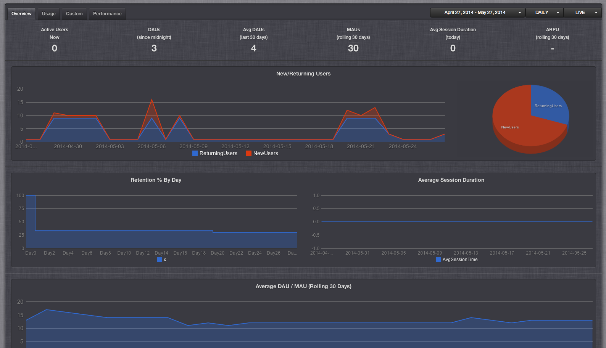
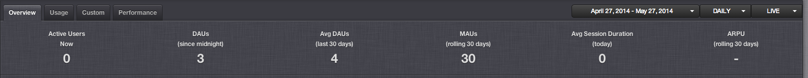
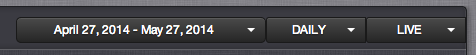
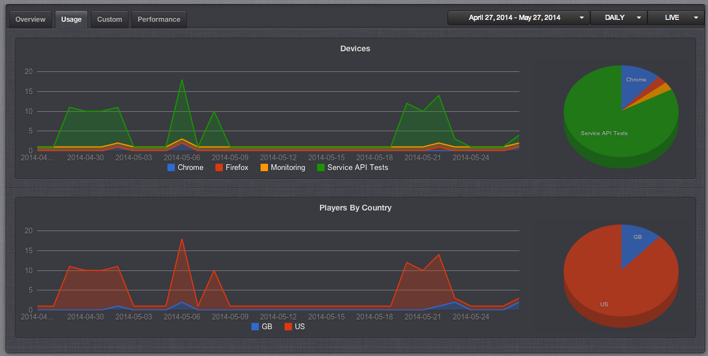
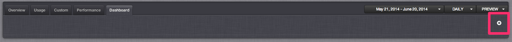
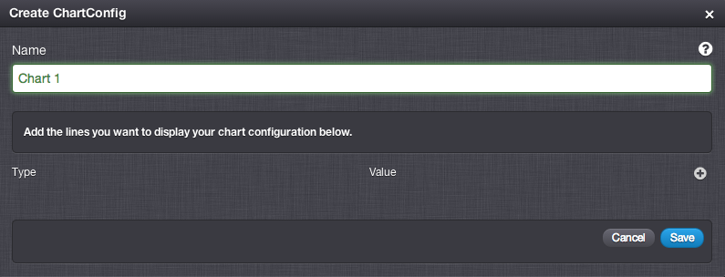
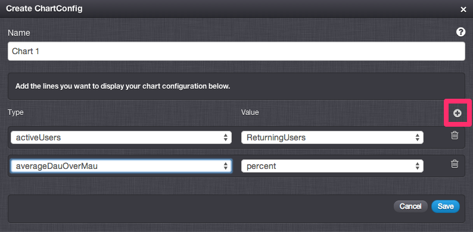
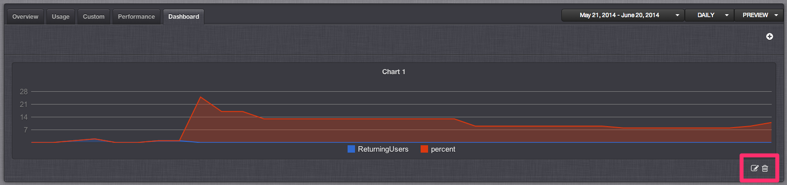

# Analytics

GameSparks provides several components of the analytics stack needed to operate a game as a service:

  1. The backend, i.e. the NoSQL database (see [NoSQL Explorer](/?p=53) in this Manual for details).
  2. The events library, with the ability to record any custom event (see [Events](/?p=1945) in this Manual for details).
  3. The analytics user interface in the developer portal that cover common games reporting requirements, which should be sufficient for most indie developers.
  4. Export to third party front end tools (such as Tableau or Qlikview) or direct ad hoc querying of the NoSQL database for detailed analysis.

## Overview Tab

There are several graphs on the overview page.

  * New / Returning players - shows the number new (in red) and returning players (in blue).
  * Retention % by day - shows the number of returning players as a percentage of the total players for a given day.
  * Average Session Duration - shows the average session duration in seconds.
  * Average DAU / MAU - shows the average daily active player count over the monthly active player count. This is a measure of 'engagement'.

### Big Numbers

The Big Numbers are located at the top of the overview tab.

This panel provides a number of analysis data aggregate metrics about how well your game is performing and indicates levels of engagement within the game’s current player base.

  * Active Players Now - shows the total number of players that are currently connected to you game.
  * Daily Active Users (DAU) - shows the total number of unique daily active players since midnight.
  * Average Daily Active Players - show a rolling average over the last 30 days for the DAU Big Number.
  * Monthly Active Users (MAU) - shows a rolling total over the last 30 days of the number of active players.
  * Average Session Duration - shows the average player session duration for today.
The Big Numbers panel is a live display which updates every minute or so.

### Display Control Drop Down Menus

There are three drop down menus on the overview page that allow you to control the data displayed in the overview graphs.

  * Date range menu - this menu allows you chose the start and end date for the data set displayed.
  * Sample frequency menu - this menu allows you to choose between hourly, daily and monthly frequencies.
  * Stage menu - this menu allows you to choose which stage, preview or live, the data is displayed for.

## Usage Tab

 This tab contains graphs pertaining to usage.

  * Devices - shows the different devices that your players are playing to play your game.
  * Players by Country - shows the different countries that your players are in who are playing you game.

## Custom Tab

 This tab contains graphs which show the data gathered as a result of your game sending an [AnalyticsRequest](/?p=2218) to the GameSparks platform.

  * Count - shows the number of times a given custom key has been sent via the AnalyticsRequest
  * Average per Player - shows the average number of times per player that a given custom key has been sent via the AnalyticsRequest
  * Average Duration - shows the average duration for each timed request sent via the AnalyticsRequest

## Performance Tab

This tab displays a number of performance related graphs.

  * Average Requests per Player - shows the average number of request generated per player within you game.
  * Average Response Time - show the average response time (in milliseconds) that the GameSparks platform has taken to respond to API request calls.
  * Average Javascript Execution Time - show the average time (in milliseconds) that the GameSparks platform has spent executing you [Cloud Code](/?p=40) JavaScript code.
  * Average Storage per Player - shows the average amount of cloud data per player that your game is using.
  * Average Bandwidth per Player - shows the average amount of bandwidth per player that your game is using.

## Dashboard Tab

This tab allows you to define your own graphs based on the analytic values that the GameSparks platform gathers. When you first access the Dashboard tab there are no charts defined and the screen will look like this. To add a chart click the plus icon .

 Enter a name for you chart in the Name field.

 

 To add lines to you chart click the plus icon , select the required Type and Value then click the *Save* button.

 

Add as many lines as you require. The resulting chart is displayed after you save the chart configuration.

Use the edit  and delete  icons to edit or delete your chart configuration.
