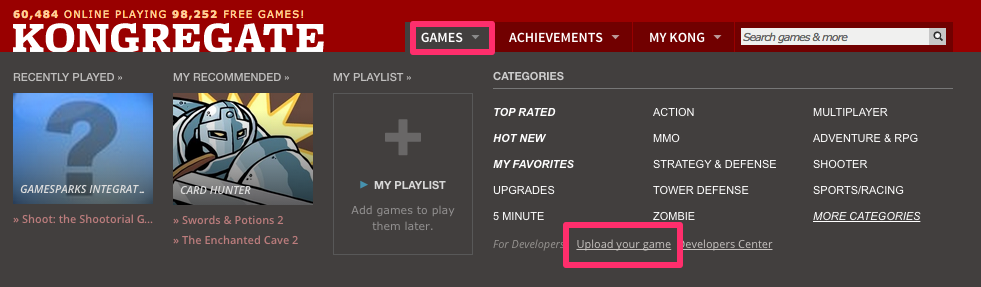
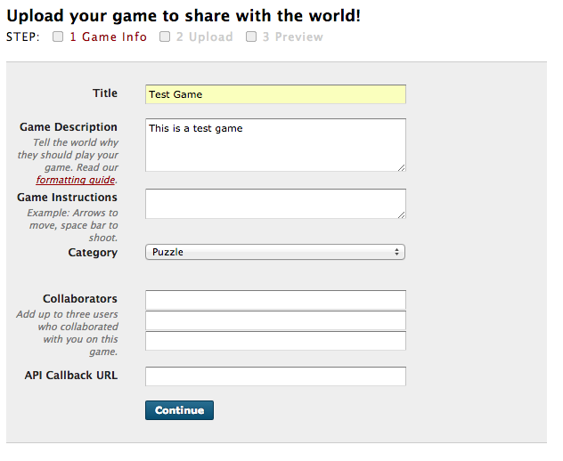
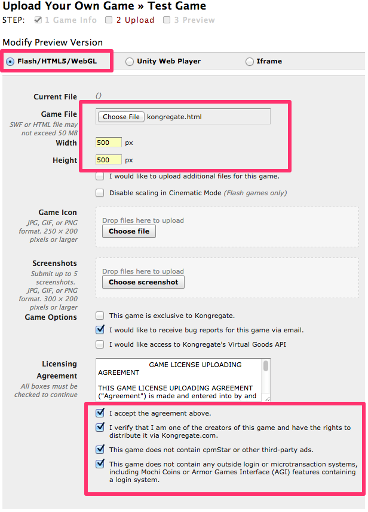
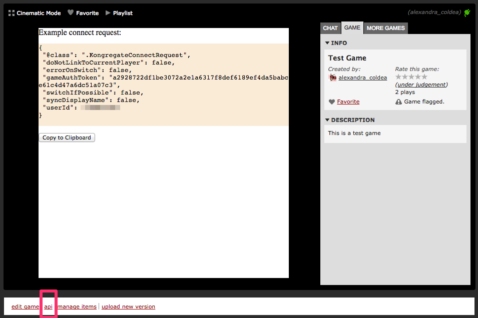
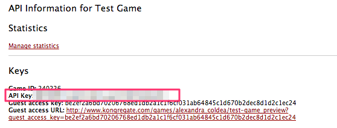
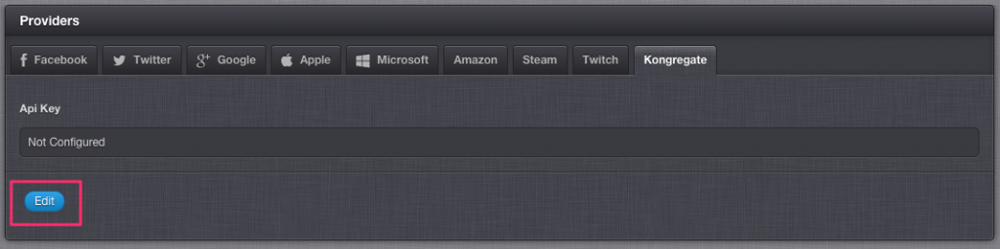

# How to authenticate a player using their Kongregate account

Kongregate authentication allows you to provide your players with a simple way to sign in with their Kongregate account, and allows GameSparks platform to then use the players profile to drive its social features. In this exercise you’ll go through setting up the necessary configuration with Kongregate and how you can then use that to connect your players.

## Setting up a Kongregate application

For a successful *KongregateConnectRequest* the following data needs to be provided to GameSparks:

* Game API Key
* The user's ID
* an authentication token valid for the (user,game) pair
This data can be obtained from Kongregate, by uploading a game.

### Uploading a sample Kongregate game

The following steps will guide you through the process of creating a sample game and obtaining the necessary details. Go to the [Kongregate home page](http://www.kongregate.com/) and log in. If you scroll over the "Games" section, you will be able to see a link to "Upload your game"



Alternatively, go directly to the [Upload game page](http://www.kongregate.com/games/new). Fill in your game details and press *Continue*



Next, you need to upload your game. For the sake of this tutorial, you can download a test game from here:  The only thing that this test game does is provide you with the credentials necessary for making a connect request. The following image presents a sample configuration for the game:



After clicking *Upload* you will be redirected to your game. This is where you will be able to obtain all of the information you need in order to perform a KongregateConnectRequest.

### Configure Kongregate game details

While you are previewing your game in Kongregate, click on the *api* link at the bottom of your game.



This will lead you to a view that displays your game credentials, from where you will need to copy the value of your API Key:



In a separate tab, go to the Gamesparks developer portal. Navigate to *your game →Configurator→Integrations→Kongregate*



Press *Edit* and set your API key to be the one you just copied from Kongregate.

### Perform a KongregateConnectRequest

Return to Kongregate screen where you play your game. This should display a connect request for your user. The fields that are used to perform the authentication are *gameAuthToken* and *userId*. Copy this connect request. In another tab, go to the GameSparks portal and navigate to *Test Harness*. Paste your request in your JSON editor and that's it.

Here is a sample request for connecting to Kongregate:

```  
{
 "@class": ".KongregateConnectRequest",
 "doNotLinkToCurrentPlayer": false,
 "errorOnSwitch": false,
 "gameAuthToken": "a2928722df1be3072a2e1a6317f8def6189ef4da5babce61c4d47a6dc51a07c3",
 "switchIfPossible": false,
 "syncDisplayName": false,
 "userId": "123"
}
```

And here is a sample response:

```
{
 "@class": ".AuthenticationResponse",
 "authToken": "874289c6-6565-4860-9160-d94805d558c9",
 "displayName": "alexandra_coldea",
 "newPlayer": true,
 "scriptData": null,
 "userId": "55672ab7e4b0cc0a541f6906"
}
```

You can find more details about the Kongregate authentication protocol and the client functions that you can use [here](http://developers.kongregate.com/docs/api-overview/intro).
