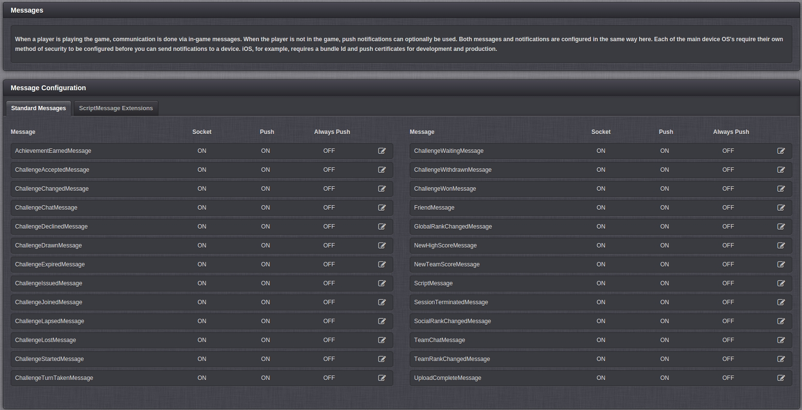
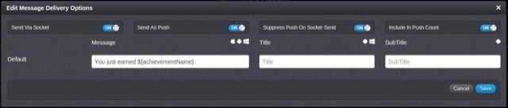

# Messages

The GameSparks platform allows you to send messages to your players.  These can be either a). in-game messages when a player is playing the game, or b). push notifications when they are not playing the game (including email if desired, via an integration with SendGrid). This section allows you to set up and configure these messages.

The Message Configuration box contains all the message types available on the platform.  Although most of these appear to relate to Challenges there are other categories supported (uploads, achievements, p2p messaging) and the 'ScriptMessage' option gives you full flexibility.

### Message Configuration

You can configure each message type by clicking on the __ icon for the desired message. You will be presented with the following screen:

* *Send Via Socket* \- Sends the message via the Socket.
* *Send As Push* \- Send the message as a push notification.
* *Suppress Push On Socket Send* \- If message is sent via the Socket, don't send it as Push as well.
* *Include In Push Count* \- Should the message be included in Push Count.
* *Message* \- The message to be sent.
* *Title* \- The title of the Message.
* *Subtitle* \- The subtitle of the Message.

### Script Message Extensions

GameSparks allows you to create custom messages using Script Message Extensions, these messages can be sent from your Cloud Code.

These Messages are uniquely identified using a ShortCode.
