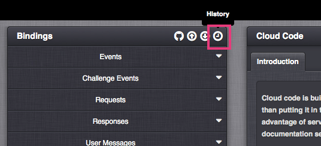

# How to view Cloud Code History

It's possible to manage your Cloud Code revisions between Snapshots. This allows us to review and revert to previous versions of Cloud Code that appears on events and provides us with a visual indicator to the differences in the Cloud Code.

## Accessing Cloud Code History

*1.* To access Cloud Code History, navigate to the *Cloud Code* section in the *Configurator* and select the *History* button, as seen below.

This opens the Cloud Code History tool. The interface consists of 2 columns to compare an item from 2 different Snapshots.

## Comparing Snapshots

In the left column named *Base*, we can see the current Workspace configuration and the latest saved Snapshot. In the right column, *Compare to*, we see every other Snapshot before them. This is because we decided to work from right-to-left, showing the latest version always in the left column, comparing it to the right which will always be something older than that selected in the left.

 

Selecting Snapshot *8* in the *Base* column ....... displays any older Snapshots than Snapshot *8.*

Any green Snapshot is indicated as the one published to LIVE.

## Differences

In the far-right of the screen, there is a drop-down labelled *Differences.* Depending on the comparison of Snapshots, it will show the items (and their location) that differ between those Snapshots. For example, new events added, edited events, and ones that have been removed:

*Key:*

 *Newly added item since *Compare to* Snapshot version

 Edited item since *Compare to* Snapshot version

 Removed item since *Compare to* Snapshot version

Lines of Cloud Code highlighted in blue depict the difference for that module or event where the Cloud Code differs:

The *Base* column will only show Snapshots with Cloud Code that are independently different from each other. It won't show Snapshots that are the same as each other.

 

*Base* column                                                                                                                          *Compare to* column

 

Setting the *Base *to Snapshot *6* will let us compare only to ...                                                 ... Snapshot *4* and earlier.

For example, in terms of the Cloud Code on my game, Snapshots *1* to *4* (including the AUTOSAVE Snapshot) are the same as each other. Actually, these Snapshots have little or no Cloud Code at all. Snapshots *6* to *11* are all different from one another. Snapshots *5* and *6* are the same as each other - I know this because if I select Snapshot *6* in the *Base* column, Snapshot *5 *is not available in the *Compare to* column.

However, we already know that Snapshot *5* is different to Snapshot *1* and separately, Snapshot *5* is different to Snapshot *2*. Therefore we can compare Snapshot *5* in the *Base* column to Snapshot *2* or Snapshot *1*, but it would be tedious to compare Snapshot *4* to Snapshot *2* or compare Snapshot *3* to Snapshot* 1 because the platform already knows the result would be the same. Are you still with me? Good, because we're trying to save you time!
