# How to create and use Cloud Code

In this exercise we use the Configurator to create an event that will then trigger a simple piece of Cloud Code. The event will contain three attributes - a String, a Number and a JSON field. The Cloud Code (a piece of JavaScript) will manipulate these values and echo them back in the event response. We will use the Test Harness to try out the Cloud Code script and the event.

## Create an Event

Go to Configurator/Events and click the plus icon to bring up the Create Event dialog.

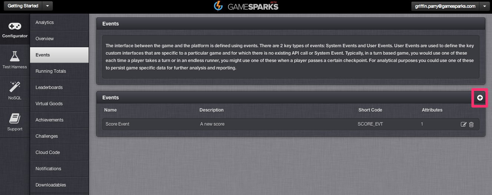

Now fill in the Event’s details and click the Save button.

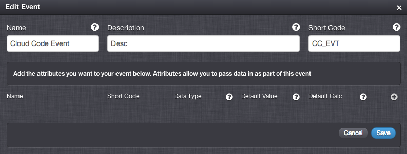

Next click the plus icon to add an Event Attribute.

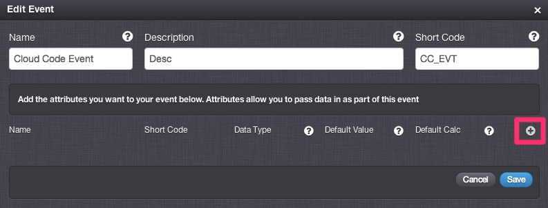

Now fill in the Event Attribute details. The Name field is self explanatory and the Short Code will be used as the key for the value that you post into the GameSparks platform from your game code. Set the Data Type to "String" and for Default Calc choose the option ‘Used in Script". Click the Save button.

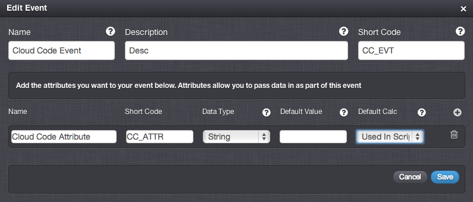

Repeat this step to create another two attributes for this event, one with "Number" for its Data Type, the other with "JSON" for its Data Type. Click Save.

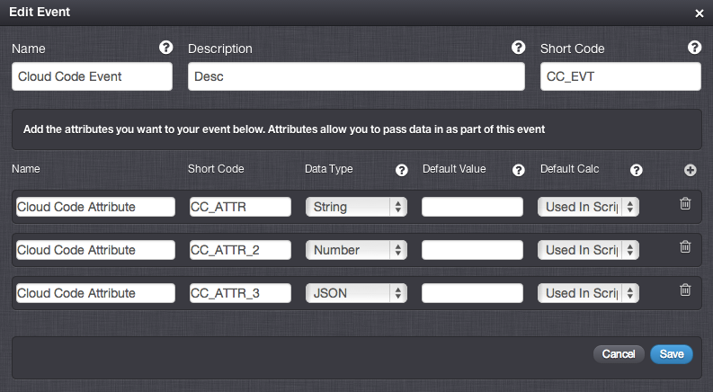

Your Events home page should now look something like this.

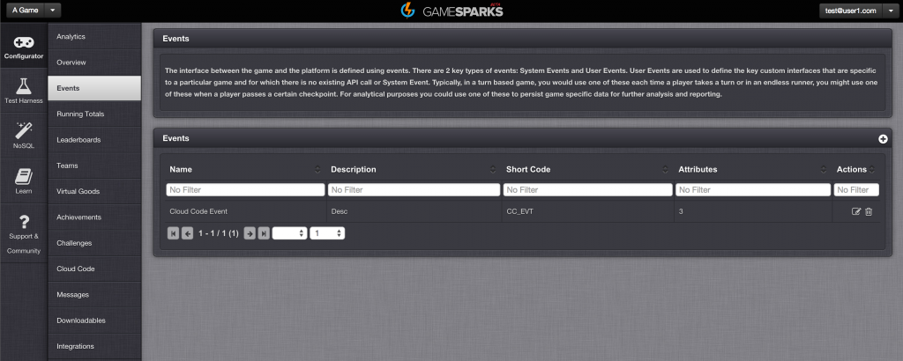

## Create a Cloud Code Script

In this section we will create a Cloud Code script linked to the Event that we have just created. Go to Configurator/Cloud Code, find Events in the Bindings section, and select Cloud Code Event. This is the Event we have just created and we will now bind cloud code to it.

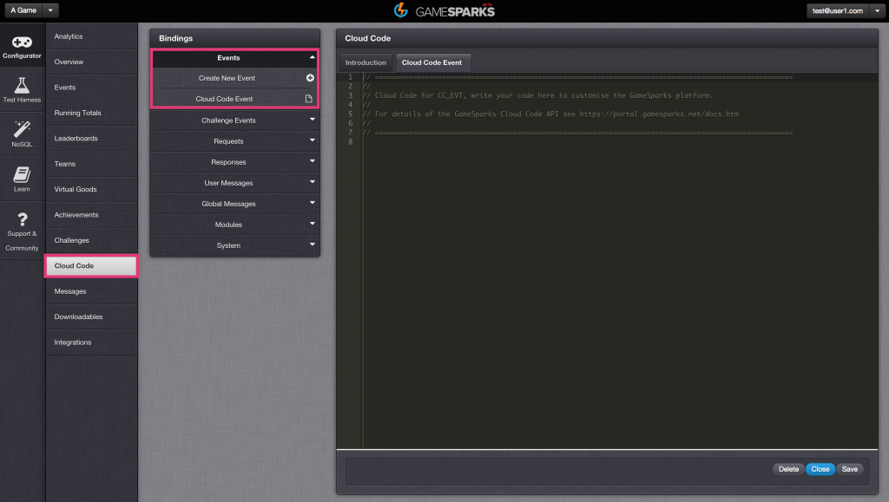

Copy and paste the following JavaScript code into the editor section.

  ```  
    var eventAttr1 = Spark.getData().CC_ATTR
    var eventAttr2 = Spark.getData().CC_ATTR_2
    var eventAttr3 = Spark.getData().CC_ATTR_3
    Spark.setScriptData("eventAttr1", eventAttr1.toUpperCase());
    Spark.setScriptData("eventAttr2", eventAttr2 * 10);
    eventAttr3.won = true
    Spark.setScriptData("eventAttr3", eventAttr3);
```

Click Save at the bottom right hand corner. Your page should now look like this.

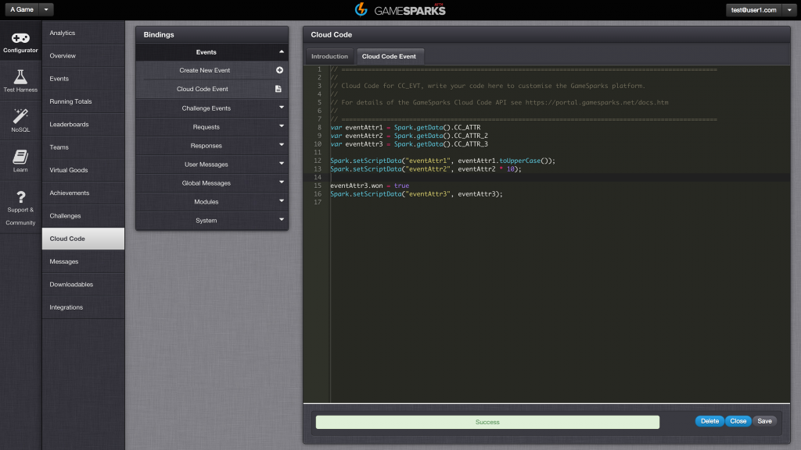

The first three lines of the script use the Spark.getData function to access the attribute values of the incoming Event. Notice how these attributes match the values we gave the Event Attribute short codes in the previous section. The remaining lines use the Spark.setScriptData function to add three new fields to the response that is delivered to the calling client. The first line takes the first attribute and converts it to uppercase, the second multiplies the second attribute value by 10 and the final two lines add a new property to an incoming JSON object and assign that to the response. You're now ready to test the code via the Test Harness.

## Testing the Cloud Code script and Event with the Test Harness

In this section we will use the Test Harness to register a test player with the preview version of the game, authorise this player and post an event that will trigger our Cloud Code script. We will see the JSON requests and responses containing the data inserted by the script.

### Register test players

Go to Test Harness/Authentication and select RegistrationRequest. Then change the userName and displayName as shown below.

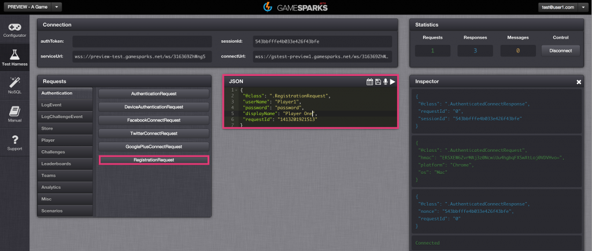

To send this JSON request to the GameSparks platform press the Play icon.

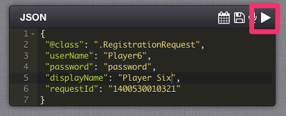

The Inspector shows the request (in green text) that was sent sent to the GameSparks platofrm via the WebSocket and the response (in blue text).

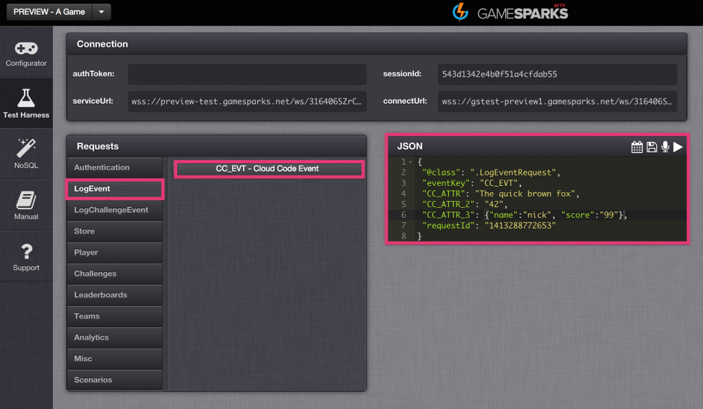

## Log Event

Go to Test Harness/LogEvent section, and select the CC_EVT event that we created above. Set each of attribute values in the JSON request as below. Note that the key names are the short codes of the Event Attributes that we created at the start of the exercise. The first attribute must be a String, the second a Number and the third attribute must be a JSON object. Click the Play icon to send the request to the GameSparks platform.

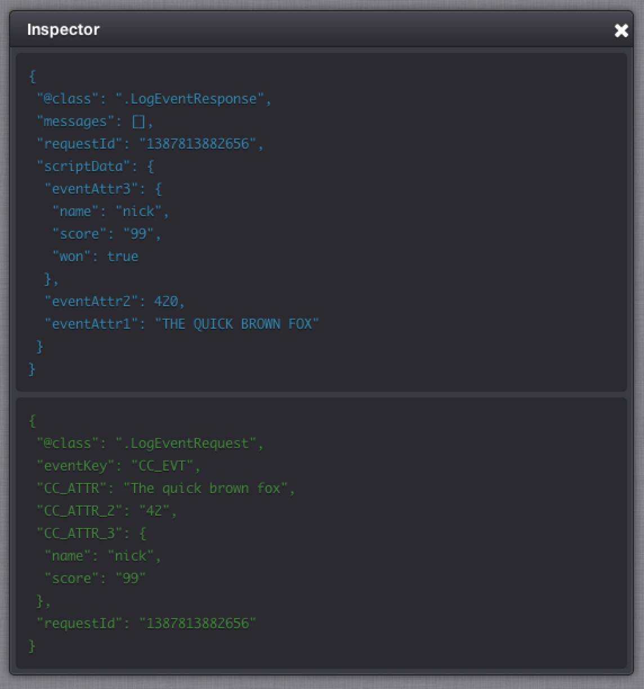

The response is displayed in the Inspector in blue text. The scriptData property contains the fields that we added from within our Cloud Code script. The keys are eventAttr1, eventAttr2 and eventAttr3. 
