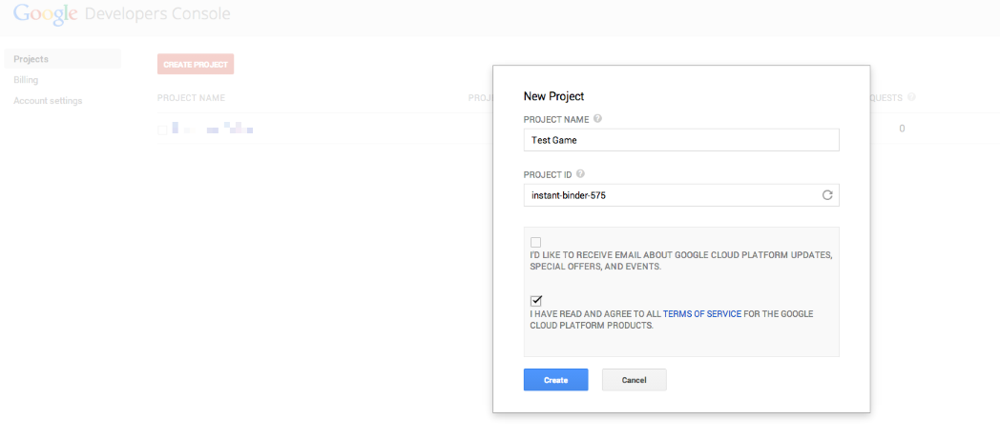
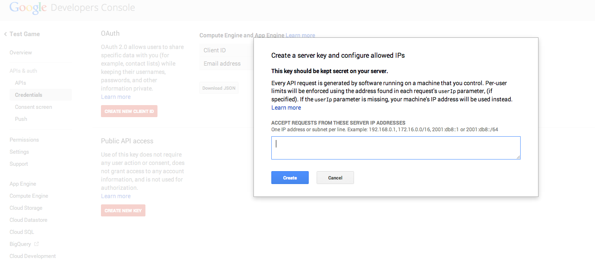
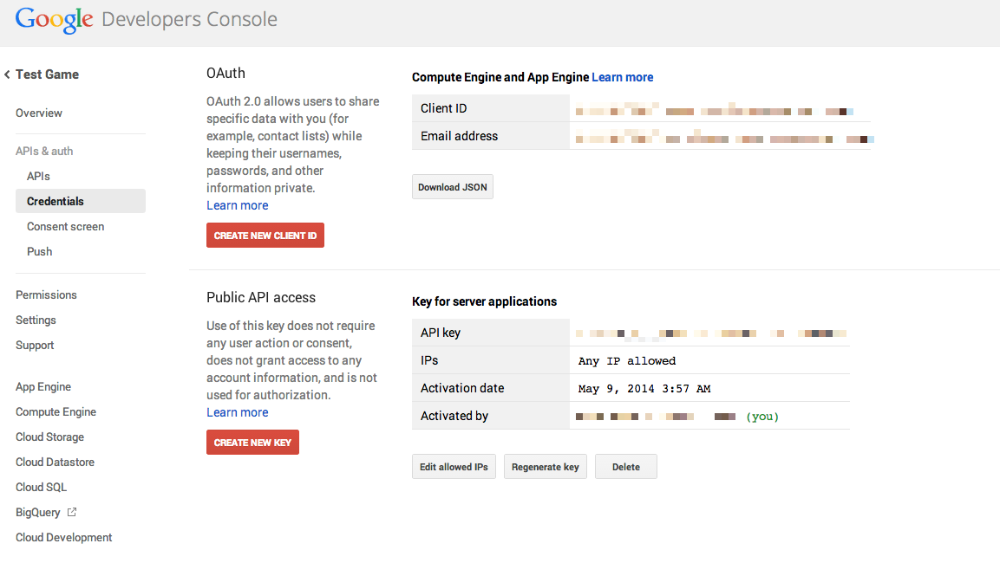
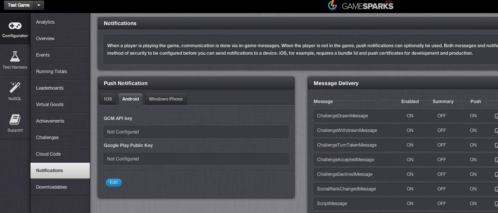
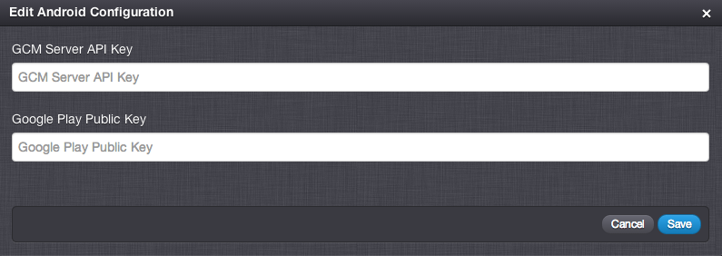

# How to configure Android push notifications

Google allows push notifications through its Google Cloud Messaging service (GCM). In this exercise you'll learn how to set up your application with GCM, enabling push notifications and getting your GameSparks game set up to allow it to send notifications to your players on your behalf.

## Setting up your application with Google

Firstly, you need to set up an application with [Google Developers Console](https://console.developers.google.com/). Click "Create Project", give your project a name, and click "Create".



Once your application has been created you should be able to click the link to it, and be presented with the "Overview" page. Next let's enable GCM for android. Click "APIs & auth" and scroll down until you can see "Google Cloud Messaging for Android". Click the button to turn it on (it'll now move to the top of the list).


Now you need to create a server key to authenticate the sender of notifications. Click "Credentials", and under "Public API access" click "Create New Key". Select "Server key", and then click "Create".



You should now have an api key that can be used to send push notifications to an android client for your game.



## Configuring your GameSparks game

Now that you have the api key, it's time to configure you GameSparks game to enable us to send push notifications on your behalf. Go to [the GameSparks developer portal](https://portal.gamesparks.net) and under "Configurator", click "Notifications".



Click "Push Notification" > "Android", and then "Edit".



Developers Console as "GCM Server API Key", and click "Save".

That's all there is to it! Your GameSparks game is now configured to send push notifications to your players on your behalf.

## Implementing a GCM Client

The detail of the GCM client is beyond the scope of this exercise, but there are excellent resources available to help you get going with this. Check out [the official android documentation](http://developer.android.com/google/gcm/client.html) as a great place to start. This covers registering your player's device with GCM and obtaining a registration id, which you will use in the next step. If you follow the steps in the official tutorial, the method you will hook into in the next step is:

```
private void sendRegistrationIdToBackend() {
   // Your implementation here.
 }

```

## Registering a device for push notifications

The final step required to actually deliver a push notification is for the GameSparks service to be able to identify your player's device to be able to send the notifications. This is accomplished with a [PushRegistrationRequest](/documentation/request-api/misc-request-api/pushregistrationrequest).

For an authenticated player in the GameSparks Test Harness, send:

```
{ "@class": ".PushRegistrationRequest",
"deviceOS": "ANDROID",
"pushId": "DEVICE_REGISTRATION_ID",
"requestId": "1399640846121" }

```

Where *DEVICE_REGISTRATION_ID* is the registration id returned from the call to *GoogleCloudMessaging.register* in the client. The GameSparks platform is now capable of pushing message to this player, even while they're not playing your game. For more details on push notifications within the GameSparks platform, check out [Messaging](..\Authentication and Player Profile\Messaging.html).
